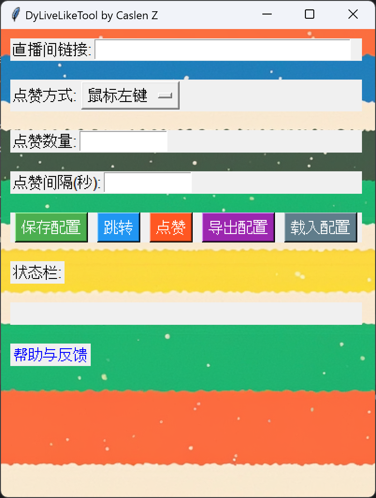

# DyLiveLikeTool

  
  
  
  </a>
  

### 目录：[程序界面](#AppPage)、[依赖库](#DependentLibrary)、[使用方法](#Usage)、[注意事项](#Precautions)、[免责声明](#Disclaimer)、[更新说明](#UpdateInstructions)、[许可证](#Licence)、[联系开发者](#ContactDeveloper)

---

---
## 程序界面

---

---
## 依赖库  
### -tkinter -webbrowser -time -pynput -os -datetime  

---

---
## 使用方法
1. 打开应用程序 “DyLiveLikeTool”；
2. 输入直播间链接
   1. 在浏览器中打开 [抖音直播](https://live.douyin.com) ；
   2. 找到点赞使用目标的直播间，并且点击进入（能看到直播间评论区即为进入了直播间）；
   3. 复制此时的网址，网址格式应为 “https://live.douyin.com/ + 12 位数的 UID 。”；
   4. 将网址粘贴到程序的 “直播间链接” 一栏。
3. 选择点赞方式
    - 鼠标左键：即使用鼠标左键进行点赞；
    - 键盘 Z 键：即使用键盘 Z 键进行点赞。键盘 Z 键是抖音直播间点赞快捷键；
4. 输入点赞数量（数值应在 10-3000 之间）  
    - 一段时间内，一个抖音账号只能连续点赞 3000 次，到 3-5 分钟左右可再次点赞。每个账号允许累计最大点赞数在 6000-9000 之间。
5. 点击 “保存配置” 
6. 点击 “跳转” ，程序会自动打开默认浏览器并跳转到指定直播间
7. 点击 “点赞” ，程序会弹出提示窗口，然后在指定秒数内开始点赞
    - 选择 “鼠标左键” 点赞，程序会在 “点赞” 按钮点下后 5 秒内开始点赞，建议此时在窗口弹出后，用户手动点击一下直播间窗口，防止鼠标可能选中其他窗口导致点赞失败；
    - 选择 “键盘 Z 键” 点赞，程序会在 “点赞” 按钮点下后 7 秒内开始点赞，此时在窗口弹出后，用户 ****必须**** 手动点击一下直播间窗口，否则 **必然** 导致点赞失败；
    - 鼠标大幅度移动，点赞自动停止，重新打开即可。
8. 状态栏会显示任何报错、提示等，请留意观察
    - 报错代码查询请移步 [报错代码查询](#ErrorCodeQuery) 。
9. 如果用户有经常需要自动化点赞的直播间，用户可以点击 “导出配置” 按钮，将配置固定保存在用户的电脑中
    - 将直播间链接、点赞方式、点赞数量都填写、选择完整；
    - 点击 “导出配置” 按钮，程序会弹出窗口要求用户输入直播间名字，以便辨认配置适用对象；
    - 填写完毕后，点击 “OK” ，程序会自动将配置文件保存在 ` 程序目录\dist\Config` 文件夹中，名称为 “直播间名字-月-日-时-分-秒.czad” ，用户可以将其移动、复制、删除，不建议用户手动修改文件内容。（若您是运行 Py 文件来运行程序，导出的数据将保存在 ` 程序目录\Config` 文件夹中。）  
10. 当用户保存了配置文件后，用户可以点击 “载入配置” 载入这些配置
    - 点击 “载入配置” 后，程序会唤出系统窗口要求用户选择 .czad 文件，选择后点击 “完成” 即可载入。

---

---
## 注意事项
### 1. 直播间链接必须以 `https://live.douyin.com` 或 `live.douyin.com` 开头；
### 2. 点赞数量必须在 10~3000 范围内；
### 3. 点击 “点赞” 后，程序会根据不同点赞方式弹出不同提示窗口，请注意观看提示；
### 4. 提示观看完毕后，应迅速将弹窗关闭，然后在直播间窗口试点一次，防止程序执行动作后点赞无效（选择 “键盘 Z 键” 点赞， ****必须**** 执行此动作，否则点赞 ***必然*** 无效。）；
### 5. 程序在执行点赞动作时，会偶现程序无响应，这是正常现象，不影响点赞动作。在点赞完毕或用户主动中断点赞后会恢复正常；
### 6. 为方便用户在点赞过程中出现失误可以及时中断，当鼠标大幅度移动时点赞会自动停止，重新点击 “点赞” 按钮即可；
### 7. 若程序重复出现鼠标大幅度移动提示，请重启程序；
### 8. 每次修改任意参数都 ****必须**** 点击 “保存配置” 再执行点赞动作，否则修改的参数 **无效** ；
### 9. “保存配置” 只会暂时将配置保存在程序当中，程序一旦关闭配置将永久删除。因此，如果用户要长期使用，建议用户 “导出配置” ；
### #1. “一直点赞” 功能因无实际作用已被删除，用户可以手动输入单次点赞上限值 3000 到 “点赞数量” 中以实现点赞最多。

---

---
## 免责声明
本程序 ***DyLiveLikeTool*** 仅供学习和研究之用，严禁用于任何非法或违反平台规定的活动。    

使用本程序的风险由用户自行承担。作者不对因使用本程序而导致的任何直接、间接、偶然、特殊、相应而生的或惩罚性的损害负责，包括但不限于数据丢失、系统故障、收益损失或任何其他损失。  
  
### 关于数据隐私  
1. 本程序不会主动收集用户的任何个人数据；  
2. 在用户使用本程序的过程中，输入的直播间链接、点赞相关配置等信息仅在本地处理和使用，不会被传输、分享或存储至任何外部服务器；  
3. 我们无法完全保证用户输入的信息在本地的安全性，用户需自行承担因使用本程序而可能导致的非本程序直接引起的个人数据泄露风险；  
  
对于用户在使用本程序过程中可能违反的任何法律法规、平台规定或第三方权利，作者不承担任何责任。请用户在使用前确保用户的行为符合所有适用的法律、规定和道德准则。

---

---
## 更新说明
| 版本号     | 发布类型    | 发布日期        | 内容                                                                                                      | 鸣谢 |
|---------|---------|-------------|---------------------------------------------------------------------------------------------------------|----|
| V 1.0.0 | RELEASE | 2024年7月21日 | 发布程序                                                                                                    |    |
| V 1.0.1 | RELEASE | 2024年7月23日 | 1. 删除 “一直点赞” 功能，若要实现此功能，请参阅 [注意事项](#Precautions) 第 #1 条；   2. 将报错代码全部呈现为报错原因，方便用户排查；   3. 优化程序。 |    |

---

---
## 许可证

本项目是开源的。本程序的代码遵循 [`MIT` 许可证](https://github.com/CaslenZ/DyLiveLikeTool?tab=MIT-1-ov-file) 。  
  
特此授予任何人免费获取本软件及其相关文档文件（“软件”）副本的权利，可以不受限制地处理该软件，包括但不限于使用、复制、修改、合并、发布、分发、再许可和/或出售软件的副本，并允许向其提供软件的人员这样做，但需符合以下条件：  

- 上述版权声明和本许可声明应包含在所有软件副本或主要部分中。  
- 本软件按“原样”提供，不附带任何形式的保证，无论是明示的还是暗示的，包括但不限于适销性、特定用途适用性和非侵权性。   
- 在任何情况下，作者或版权所有者都不对任何索赔、损害或其他责任负责，无论是在合同、侵权还是其他方面，由软件或软件的使用或其他与软件相关的行为引起。

---

---
## 联系开发者

- 有关本程序的任何 Bug 提出、建议、问题等，请直接到 [GitHub Issues](https://github.com/CaslenZ/DyLiveLikeTool/issues) 提出。  
- 有其他法律、版权等方面，或用户不会使用 GitHub ，请用户致邮 [caslenzh@gmail.com](mailto:caslenzh@gmail.com) ，收到邮件后我会及时跟进。  
